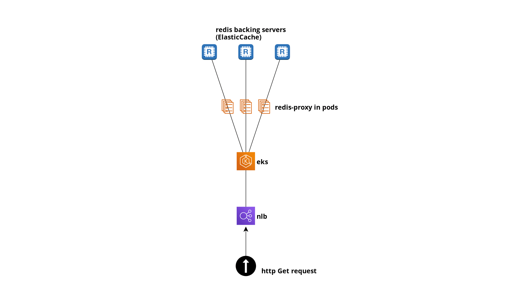

# RedisProxy 
[](https://circleci.com/gh/hunkeelin/redis-proxy)
[](https://goreportcard.com/report/github.com/hunkeelin/redis-proxy)
[](https://godoc.org/github.com/hunkeelin/redis-proxy/server)
[](https://raw.githubusercontent.com/hunkeelin/redis-proxy/master/LICENSE)


## Overview
This repo implements the redis-proxy service in pods in the below diagram


## Golang version

`redis-proxy` is currently compatible with golang version from 1.12+.

## User Manual
* The server only allow `GET` and it requires header `rediskey`. For detail documentation on configurations please checkout [documentation](server/README.md).
## Usage
```go
package main

import (
    redisproxy "github.com/hunkeelin/redis-proxy/server"
)

func main() {
    panic(redisproxy.Server())
}
```

## Example
```bash
$ redis-cli
127.0.0.1:6379> set foo1 bar1
OK
127.0.0.1:6379> set foo2 bar2
OK
127.0.0.1:6379> set foo3 bar3
OK
127.0.0.1:6379> set foo4 bar4
OK
127.0.0.1:6379> set foo5 bar5
OK
127.0.0.1:6379> exit

$ make build
o build -o redis-proxy -v
$ export CACHECAPACITY=3
$ ./redis-proxy &
INFO[0000] Starting proxy with the following configuration
INFO[0000] Redis Backing Host: `localhost`
INFO[0000] Redis Backing port: `6379`
INFO[0000] Cache TTL: `30` seconds
INFO[0000] Number of Cache:  `3`
INFO[0000] Host port: `2020`
INFO[0000] Curate Cycle: `30` seconds
listening to :2020

// Should fail because require header 
$ curl -i localhost:2020
HTTP/1.1 400 Bad Request
Date: Sun, 22 Mar 2020 05:26:32 GMT
Content-Length: 0

$ curl -i localhost:2020 -H "rediskey: foo1"
HTTP/1.1 200 OK
Date: Sun, 22 Mar 2020 05:27:20 GMT
Content-Length: 4
Content-Type: text/plain; charset=utf-8

bar1

```

## Features
* HTTP webservice: Clients interface to the Redis proxy through HTTP, with the
Redis `GET` command mapped to the HTTP `GET` method.
* Single backing instance: Each instance of the proxy service is associated with a single Redis service instance. The address of the backing Redis is configured at proxy startup via an env variable. 
* Cached GET: This proxy have a caching mechanism with `x` seconds of expiration for each cache. The duration can be set via env variable as well. With size limitation.
* Included `/metrics` URI for prometheus. 
* configuratable server via env variables. 

## Design decisions 
* Since this is just an exercise it will be up to me to decide on things and I got no way to gather requirements during my offline coding session. Sequential concurrent processing doesn't make sense in this case.(A request from the second request only starts processing after the first request has completed and a response has been returned first client) This basically means adding a mutex to the entire handler which is against `go` philosphy. If race condition is an issue we can use threadsafe techiques such as `sync/atomic` and `sync/mutex` on write operations. An example of Sequential concurrent processing is not optimal is when redis server is timing out, causing one request to halt. This will cause every subsequence request to halt, even though they could be served from cache while hoping redis comes back up. 
* Configurations on the proxy is set via environment variables because I expect this to be deployed in docker-like environment. 

## ToDo
- Add helm.yaml for easier deployment.
- Add terraform for to setup the infrastructure needed. 
